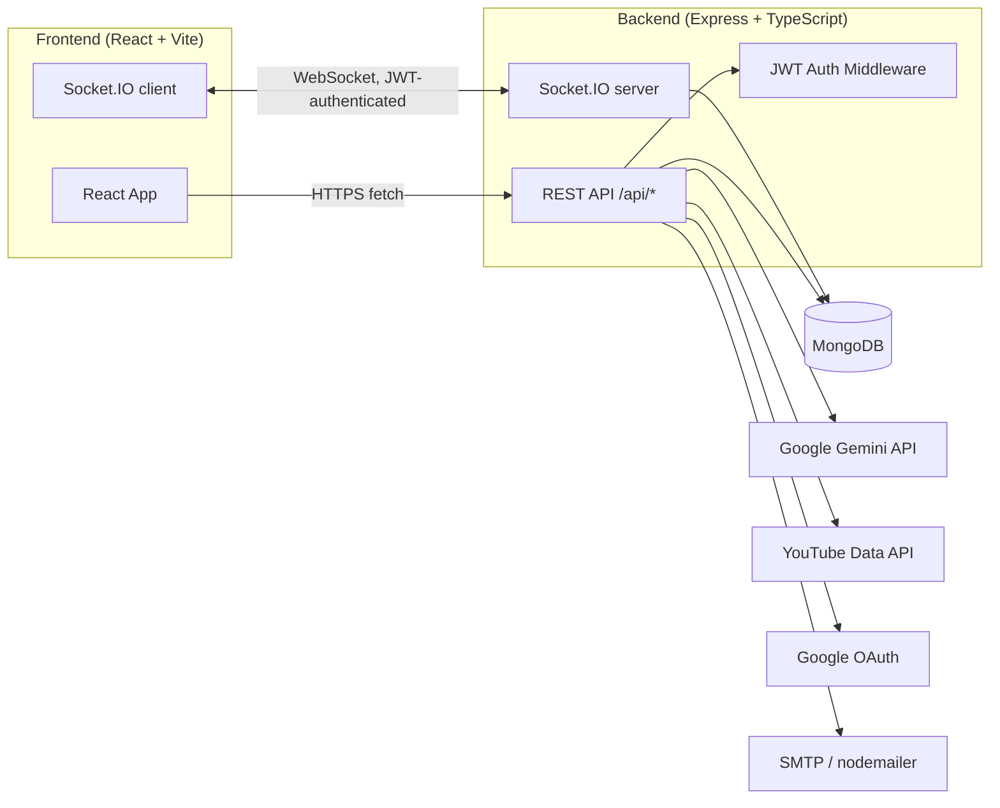

# Cadence — AI Learning Assistant & Personalized Study Planner

## Team Name

RICR-HIM_1131

## Team Members

| Role         | Name           |
| ------------ | -------------- |
| Team Leader  | Harshit Dubey  |
| Member       | Karan Rathore  |
| Member       | Ankit Pawar    |
| Member       | Mohib Shaikh   |

## Selected Theme

_AI-Powered EdTech / Personalized Learning — replace with your official track name if different._

## Problem Statement

- **Real AI Tutor chat** — Gemini-backed conversational tutor with concise answers, quizzing on
  request, and relevant embedded YouTube videos when a topic benefits from one.
- **Document-grounded mock tests** — upload a PDF/DOCX/image (syllabus, question bank, notes) and
  Gemini analyzes it (topics, priorities, difficulty spread) and generates exam questions grounded
  in that document's actual content.
- **Manual mock test generation** — generate practice questions for any subject/topic/difficulty
<<<<<<< HEAD
  without needing a document, also via Gemini.
=======
  without needing a document, also 
  via Gemini.
>>>>>>> c8bab08 ("update frontend and backend")
- **AI-generated study plans** — Gemini builds a real, ordered session-by-session schedule from
  your goal, subjects, deadline, and weak topics.
- **Real progress & achievements** — computed live from your actual study plan completions and
  mock test history, not static placeholder data.
- **Authentication** — email/password (bcrypt-hashed, JWT sessions) and real Google OAuth, both
  backed by MongoDB.

## Solution Overview

Cadence is a full-stack, AI-driven study platform that builds a **personalized, adaptive study
plan** from a student's goals, available time, and diagnosed knowledge level, then keeps adapting
it as the student studies:

- An AI tutor (Gemini-backed) answers questions conversationally and can suggest relevant YouTube
  videos.
- Students can upload their own study material (PDF/DOCX) and get AI-generated, document-grounded
  mock tests and topic/priority analysis instead of generic question banks.
- Mock test results and session outcomes feed back into the study plan — missed or poorly
  understood sessions get reshuffled automatically.
- Study Groups let students studying for the same exam collaborate in real time, invite each other
  by email, and ask the AI tutor questions together in a shared chat.
- Progress, streaks, and achievements are computed from real activity, not placeholder data.

## Technology Stack

**Frontend**
- React 18 + TypeScript, built with Vite
- Tailwind CSS, Framer Motion (animation), Recharts (charts), Lucide React (icons)
- React Router v7
- Socket.IO client (real-time updates)

**Backend**
- Node.js + Express + TypeScript (`tsx` for dev, `tsc` for build)
- MongoDB (official `mongodb` driver, no ORM)
- Socket.IO (real-time server, JWT-authenticated sockets)
- `jsonwebtoken` + `bcryptjs` for auth
- `google-auth-library` for Google Sign-In verification
- `@google/generative-ai` (Gemini) for all AI features
- `nodemailer` for password-reset emails (any SMTP provider)
- `multer`, `pdf-parse`, `mammoth` for document upload/text extraction

**Database**
- MongoDB (see [Database Details](#database-details))

**External APIs**
- Google Gemini API (AI tutor, mock test generation, study plan generation, document analysis)
- YouTube Data API v3 (optional — video suggestions in the AI tutor)
- Google OAuth 2.0 (Sign in with Google)

## Installation Guide

### Prerequisites

- Node.js 18+
- A running MongoDB instance (local `mongodb://localhost:27017/` works for development)

### 1. Clone and install dependencies

```bash
git clone <repo-url>
cd project
cd frontend && npm install
cd ../backend && npm install
```

### 2. Configure environment variables

```bash
cp frontend/.env.example frontend/.env
cp backend/.env.example backend/.env
```

Then fill in the values — see [Environment Variables](#environment-variables) below.

### 3. Run the app

In two separate terminals:

```bash
# Terminal 1 — backend (http://localhost:3002)
cd backend
npm run dev

# Terminal 2 — frontend (http://localhost:5173)
cd frontend
npm run dev
```

Open `http://localhost:5173`.

### Useful scripts

Run from `frontend/` or `backend/` respectively:

| Command              | What it does                        |
| -------------------- | ------------------------------------ |
| `npm run dev`         | Start the dev server                |
| `npm run build`       | Type-check and build for production |
| `npm run typecheck`   | Run TypeScript with no emit         |
| `npm run lint`        | Run ESLint                          |

## Environment Variables

None of these are committed to git — `.env` is gitignored in both `frontend/` and `backend/`.

**`frontend/.env`**

| Variable                | Required | Notes                                                                              |
| ------------------------ | -------- | ----------------------------------------------------------------------------------- |
| `VITE_API_URL`           | Yes      | Backend URL, e.g. `http://localhost:3002/api`                                       |
| `VITE_GOOGLE_CLIENT_ID`  | Optional | Enables the "Continue with Google" button. Same value as `GOOGLE_CLIENT_ID` below.  |

**`backend/.env`**

| Variable            | Required | Notes                                                                                                     |
| -------------------- | -------- | ------------------------------------------------------------------------------------------------------- |
| `PORT`               | Yes      | Backend port                                                                                              |
| `CLIENT_ORIGIN`      | Yes      | Frontend origin, used for CORS and to build links (e.g. password reset links)                            |
| `JWT_SECRET`         | Yes      | Long random string used to sign session tokens                                                            |
| `GEMINI_API_KEY`     | Yes      | [aistudio.google.com/apikey](https://aistudio.google.com/apikey) — powers all AI features                 |
| `GEMINI_MODEL`       | No       | Defaults to `gemini-flash-lite-latest`                                                                    |
| `YOUTUBE_API_KEY`    | Optional | [console.cloud.google.com](https://console.cloud.google.com/apis/credentials) — video suggestions in AI tutor |
| `MONGODB_URI`        | Yes      | e.g. `mongodb://localhost:27017/`                                                                         |
| `MONGODB_DB_NAME`    | No       | Defaults to `nova`                                                                                         |
| `GOOGLE_CLIENT_ID`   | Optional | OAuth client ID (Web application type) — same value as `VITE_GOOGLE_CLIENT_ID`                            |
| `SMTP_HOST`          | Optional | SMTP server for sending password-reset emails. Left blank, the reset link is logged to the server console and shown directly in the app instead of emailed. |
| `SMTP_PORT`          | Optional | Defaults to `587`                                                                                         |
| `SMTP_USER`          | Optional | SMTP auth username                                                                                        |
| `SMTP_PASS`          | Optional | SMTP auth password / app password                                                                         |
| `SMTP_FROM`          | Optional | "From" header for reset emails                                                                            |

## API Documentation

All endpoints are prefixed with `/api`. Endpoints marked 🔒 require `Authorization: Bearer <token>`.

**Auth** — `/api/auth`

| Method | Endpoint                | Description                                          |
| ------ | ------------------------ | ----------------------------------------------------- |
| POST   | `/signup`                 | Create an account (email + password)                 |
| POST   | `/signin`                 | Sign in with email + password                        |
| POST   | `/google`                 | Sign in / sign up with a Google credential            |
| POST   | `/forgot-password`        | Request a password-reset link (rate-limited)          |
| GET    | `/verify-reset-token`     | Check whether a reset token is still valid            |
| POST   | `/reset-password`         | Reset password using a valid token                    |
| GET    | `/session`        🔒      | Get the current session's user                        |

**Documents** — `/api/documents` 🔒

| Method | Endpoint          | Description                                             |
| ------ | ------------------ | --------------------------------------------------------- |
| POST   | `/analyze`          | Upload a PDF/DOCX and get AI topic/priority analysis       |
| POST   | `/generate-test`    | Generate a mock test grounded in a previously analyzed doc |

**AI Tutor** — `/api/tutor` 🔒

| Method | Endpoint   | Description                       |
| ------ | ----------- | ----------------------------------- |
| GET    | `/history`   | Fetch this user's chat history      |
| POST   | `/chat`      | Send a message to the AI tutor      |

**Mock Tests** — `/api/mocktest` 🔒

| Method | Endpoint          | Description                                  |
| ------ | ------------------ | ----------------------------------------------|
| POST   | `/generate`         | Generate a mock test (subject/topic/difficulty) |
| POST   | `/suggest-topics`   | AI-suggested topics for a subject             |
| POST   | `/submit`           | Submit answers, get graded results            |
| GET    | `/results`          | This user's past mock test results            |

**Study Plan** — `/api/studyplan` 🔒

| Method | Endpoint                        | Description                                |
| ------ | --------------------------------- | -------------------------------------------- |
| POST   | `/generate`                        | Generate a new AI study plan                |
| GET    | `/current`                         | Get the current study plan                  |
| POST   | `/sessions/:id/complete`           | Mark a session complete                     |
| POST   | `/sessions/:id/reschedule`         | Reschedule a session                        |
| POST   | `/replan`                          | Re-adapt the plan (e.g. after missed sessions) |
| POST   | `/session-assessment`              | Generate an AI assessment for a session     |
| POST   | `/session-evaluate`                | AI-evaluate a completed session's understanding |

**Goals** — `/api/goals` 🔒

| Method | Endpoint               | Description                          |
| ------ | ----------------------- | --------------------------------------|
| GET    | `/current`               | Get the current learning goal         |
| POST   | `/diagnostic`            | Generate a diagnostic quiz            |
| POST   | `/diagnostic/evaluate`   | Evaluate diagnostic answers → knowledge level |
| POST   | `/`                       | Save a new learning goal              |
| DELETE | `/current`               | Delete the current goal               |

**Progress** — `/api/progress` 🔒

| Method | Endpoint | Description                          |
| ------ | -------- | --------------------------------------|
| GET    | `/`       | Computed progress snapshot for the user |

**Study Groups** — `/api/groups` 🔒

| Method | Endpoint             | Description                                                     |
| ------ | --------------------- | ------------------------------------------------------------------ |
| GET    | `/`                    | List all groups                                                   |
| POST   | `/`                    | Create a group                                                    |
| POST   | `/invite`              | Invite an existing user to a group by email                       |
| GET    | `/invitations`         | List your pending invitations (or a group's, with `?groupId=`)    |
| POST   | `/accept`              | Accept a pending invitation                                       |
| POST   | `/reject`              | Reject a pending invitation                                       |
| GET    | `/members`             | List a group's members (`?groupId=`)                              |
| POST   | `/remove-member`       | Remove a member (group owner only)                                |
| GET    | `/:id`                 | Get a group and its members                                       |
| POST   | `/:id/join`            | Join a group directly                                             |
| POST   | `/:id/leave`           | Leave a group                                                     |
| GET    | `/:id/messages`        | Fetch group chat messages (supports `?after=`)                    |
| POST   | `/:id/messages`        | Send a group chat message                                         |
| POST   | `/:id/ask-ai`          | Ask the AI tutor in the group chat (visible to all members)        |

**Real-time (Socket.IO)** — connect to the backend origin with `auth: { token }`

| Event                   | Direction        | Description                                      |
| ------------------------ | ----------------- | --------------------------------------------------|
| `invitation:new`         | server → client   | A new group invitation was sent to you            |
| `invitation:responded`   | server → client   | Someone accepted/rejected your invitation         |
| `group:updated`          | server → client   | A group's membership changed (join/leave/accept/remove) |
| `group:removed`          | server → client   | You were removed from a group                     |

## Database Details

MongoDB, database name from `MONGODB_DB_NAME` (defaults to `nova`). Collections:

| Collection               | Purpose                                                        |
| -------------------------- | ------------------------------------------------------------------ |
| `users`                    | Accounts — email, bcrypt password hash (or Google ID), profile name |
| `password_reset_tokens`    | Single-use, 15-minute-expiry hashed tokens for password resets      |
| `groups`                   | Study groups — name, exam, topic, owner, member IDs                 |
| `group_invitations`        | Pending/accepted/rejected invitations to join a group                |
| `group_messages`           | Study group chat messages (user + AI turns)                          |
| `goals`                    | A user's current learning goal (exam, subjects, deadline, level)     |
| `study_plans`               | AI-generated study plans                                            |
| `study_sessions`            | Individual sessions within a study plan                              |
| `chat_messages`             | AI Tutor 1:1 chat history                                            |
| `assessment_results`        | Mock test / session assessment results                               |

No ORM is used — collections are accessed directly via the official `mongodb` driver, with thin
typed store modules in `backend/src/lib/`.

## Architecture Diagram



The frontend never talks to Gemini, YouTube, MongoDB, or SMTP directly — everything is proxied
through the backend so API keys and database credentials stay server-side.

## Screenshots

_Add screenshots of key screens here before submission (Landing page, Login, Dashboard, AI Tutor,
Study Plan, Study Groups, Reset Password) — e.g. in an `assets/screenshots/` folder, referenced as:_

```markdown

```

## Deployment Link

Not deployed yet — currently runs locally only (see [Installation Guide](#installation-guide)).

## Future Scope

- Sync learning goals, study plans, and progress to the account server-side (currently in
  browser `localStorage`, per-device)
- Push notifications / reminders for upcoming study sessions
- Richer group features: shared study-plan sessions, group leaderboards
- Native mobile app
- Support additional exam boards/curricula beyond the current defaults
- Move the in-memory rate limiter to a shared store (e.g. Redis) for multi-instance deployments

## Demo Credentials

Demo account emails for judges:

- `rajricr@gmail.com`
- `harshit.dubey@example.com`

> Passwords for these accounts are shared with judges separately (e.g. via the submission form),
> not in this public README. To set/reset a password for either account, use **Forgot password**
> on the login screen.
